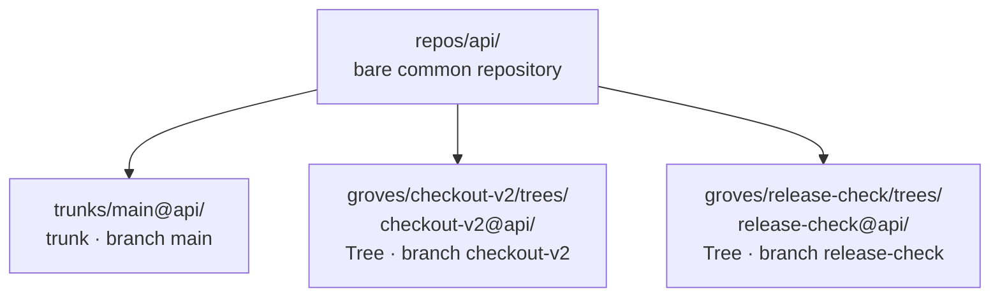

# grove-multirepo

Grove is a command-line tool for macOS that lets you work on one change across several Git repositories as a single unit.

## Why Grove

Say a feature touches your `api` and `web` repositories. You need a branch in each, a separate checkout of each so your other work is left alone, and later a clean-up that does not lose anything you have not pushed. With plain Git that is a `git worktree add` in every repository, folders you name and keep track of yourself, and a clean-up in every repository.

With Grove the change is one named Grove:

```bash
grove init
grove repo add git@github.com:example/api.git --name api
grove repo add git@github.com:example/web.git --name web
grove new checkout-v2 --repo api --repo web
```

In this example, `grove new` creates one worktree per selected repository, each on a branch named `checkout-v2`:

```text
groves/checkout-v2/trees/
  checkout-v2@api/    # worktree of api, on branch checkout-v2
  checkout-v2@web/    # worktree of web, on branch checkout-v2
```

Work in those folders with your editor, plain Git, or a coding agent. When you want to put the change aside, `grove archive checkout-v2` removes both worktrees while keeping every branch. By default, it refuses to discard uncommitted files, including Git-ignored files, or archive commits it cannot verify as pushed. `grove restore checkout-v2` recreates the worktrees at the archived commits.

Each Grove is its own set of folders, so several changes can stay open side by side, for example one per coding agent, without stashing or switching branches.

Every worktree remains usable with ordinary Git tools. Commit and push separately in each repository; Grove coordinates the worktrees, not the commits. There is no daemon or server, and Grove's own state lives in the workspace folder.

## Install

Requires macOS, Node 24 or newer, and Git.

```bash
npm install -g grove-multirepo
grove --version
```

The npm package is `grove-multirepo`; the installed command is `grove`.

The examples use placeholder GitHub URLs; replace them with repositories you can access. Run `grove init` in a directory you want to use as a workspace, then run the other Grove commands from that workspace.

## Working across repositories

Continuing the `api` and `web` workspace from [Why Grove](#why-grove), with `checkout-v2` active, add a third repository and create another Grove:

```bash
grove repo add git@github.com:example/mobile.git --name mobile

grove tree add checkout-v2 mobile             # widen the Grove: checkout-v2@mobile
grove new release-check --all                 # a new Grove with a Tree in every registered repository
```

Review and commit your changes with plain Git in each worktree, then push each repository's branch. For example, push `api` with:

```bash
git -C groves/checkout-v2/trees/checkout-v2@api push -u origin checkout-v2
```

Take work down:

```bash
grove tree remove checkout-v2 checkout-v2@mobile  # remove one Tree; its branch is retained
grove archive checkout-v2    # remove every Tree, keep the refs, record a restore recipe in .grove/groves/
grove restore checkout-v2    # rebuild every Tree at the archived commits (--latest follows each branch tip)
grove delete release-check   # remove the Grove permanently; its branches are still retained
```

Archive keeps local branches and records the commits to restore; it is not a backup. Its push check uses locally recorded remote-tracking refs, so it may require a fetch if you pushed from another checkout. `--allow-unpushed` bypasses that check but leaves you responsible for preserving those commits. Restore uses the archived commits by default; `--latest` uses the current branch tips.

In summary:

| Command | Worktrees | Branches |
|---|---|---|
| `grove new` | creates one per selected repository | creates one per repository, or adopts one with `--branch` |
| `grove tree add` | adds one to an existing Grove | creates or adopts one |
| `grove tree remove` | removes one | kept |
| `grove archive` | removes all and records their commits | kept |
| `grove restore` | recreates all at the recorded commits | kept |
| `grove delete` | removes all permanently | kept |

## Golden path

```bash
grove init
grove repo add git@github.com:example/ledger.git --name ledger
grove new pricing-fix --repo ledger
grove agent add codex codex --default
grove agent run pricing-fix
grove changes pricing-fix
git -C groves/pricing-fix/trees/pricing-fix@ledger push -u origin pricing-fix
grove archive pricing-fix
```

This separate, single-repository example includes an optional coding-agent workflow. It requires the `codex` executable to be installed and available on PATH; Grove does not install the agent. Review and commit any changes before the push and archive steps. Without an agent, skip `grove agent add` and `grove agent run` and work in the Tree with your editor and Git.

## How it works

- A **workspace** is a directory holding `.grove/` for configuration and Grove records, plus the layout roots below.
- A **repository** is registered one of two ways. A **managed** repository comes from `repo add`: a bare common Git repository plus real peer **trunk** worktrees. A **linked** repository comes from `repo link`: an existing Git repository elsewhere, registered without any Git mutation.
- A **trunk** is a managed peer worktree for a long-running branch such as `main`.
- A **Grove** is a named unit of work. A **Tree** is one repository's worktree inside a Grove, so a Grove spanning three repositories has three Trees.

Git tracks the branches and worktrees. Grove records repository registration, layout preferences, and the information needed to restore archived Groves.

| | `repo add <remote>` | `repo link <git-path>` |
|---|---|---|
| Registration | managed | linked |
| Common repository | creates a bare anchor | records the existing common directory |
| Initial trunk | creates a real peer worktree | none |
| `trunk add`/`remove`/`sync` | supported | refused before any mutation |
| Tree creation | supported | supported |
| `repo remove` | unregisters; Git data retained | unregisters; Git data retained |

Default layout. Each path is a template under `layout` in `.grove/config.json`:

```text
<workspace>/
  .grove/
    config.json
    locks/
    operations/
    groves/                         # advisory metadata and archive recipes
  repos/<repo>/                     # managed bare common repositories
  trunks/<branch-slug>@<repo-slug>/ # a checkout of each long-running branch, e.g. main@api
  groves/<grove>/trees/<tree>/      # one worktree per repository in each Grove, e.g. checkout-v2@api
  archives/<grove>/                 # present only while that Grove is archived
```

To put Groves somewhere else, change the templates before creating any; Grove refuses a layout change that would leave existing Groves outside it:

```bash
grove config set --values '{"layout":{"groves":"work/{grove}","trees":"work/{grove}/{tree}"}}'
```

For managed repositories, each trunk and Tree is a Git worktree of the bare repository under `repos/`. The arrows below mean “backs a worktree,” not folder containment. This example shows `api` with its `main` trunk and Trees in two Groves, `checkout-v2` and `release-check`; paths are relative to the workspace and use the default layout.



Use `trunk add` for additional long-running branches in managed repositories. Removing a Tree or trunk keeps its branch; `repo remove` unregisters a repository without deleting its Git data.

Prefer `repo add`. Grove then keeps its own bare repository and trunks inside the workspace, and nothing it does affects your other checkouts.

Use `repo link` only when you want Trees from a repository you already have checked out elsewhere. Grove registers it without moving or cloning it, and never creates or manages its trunks, so your checkout keeps its own branches:

```bash
grove repo link ../existing-checkout --name existing
grove new local-work --repo existing
```

New Trees start from the branch the checkout had checked out when you linked it. If that was a feature branch, pass `--base main` to `repo link` (or later `grove repo configure existing --base main`) to start from `main` instead; this creates no trunk and checks nothing out. Each Tree is a worktree of that repository on its own branch, so your checkout cannot switch to a branch a Tree has checked out, as with any Git worktree.

## Behavior and safety

For every command's exact syntax, run `grove --help` or `grove <command> --help`.

### Branches and synchronization

Grove observes native Git changes on the next invocation. By default, creation refuses a branch name that already exists; use `--branch` to adopt an existing branch explicitly. Creating a new explicit branch also requires `--from`.

For example, adopting an existing branch, then creating a new explicitly named branch from a base:

```bash
grove new existing-pricing --repo ledger --branch ledger=feature/pricing
grove new explicit-pricing --repo ledger \
  --branch ledger=feature/pricing-v2 --from ledger=main
```

`sync` supports `fetch-only`, `ff-only`, and `rebase`; it does not reset diverged branches. Use `grove sync --help` for target selection and strategy options.

### Removal and recovery

Removal keeps Git branches. `--allow-destructive-git-ignored` permits discarding only the listed ignored files; `--allow-destructive-all` also permits discarding listed tracked changes, untracked files, and loose Grove content where applicable. `--allow-unpushed` is a separate archive permission.

Use `grove doctor` to inspect the workspace and `grove reconcile` to resume interrupted structural operations. See each command's `--help` before applying repairs or destructive overrides.

### Credentials

Add repositories with an SSH URL, or an HTTPS URL plus a Git credential helper (the macOS Keychain helper or `gh auth setup-git`); `repo add` refuses a URL with embedded credentials. Managed Git operations also refuse credentials introduced only by your Git configuration by default. Set `GROVE_ALLOW_GIT_CONFIG_CREDENTIALS=1` on a single `grove` invocation to permit them, including a `reconcile` recovery run. The setting is checked again on each invocation and is never stored. A credentialed URL passed directly to `repo add` is always refused.

### Automation and compatibility

`agent run` starts one foreground process in one Tree and passes through its signals and exit status. In a Grove with several Trees, select one with `--tree`.

Add `--json` for one stable result value on stdout. Machine results include all selected targets, diagnostics, partial outcomes, and classified exit codes.

Schema-1 and schema-2 ownership workspaces are refused with a self-identifying version-skew error. Grove v3 does not interpret or migrate their ownership state; use the matching older Grove version for those workspaces. Bare repositories and attached worktrees remain ordinary Git topology and may be registered explicitly in a schema-3 workspace.

## Development

Build and run from a checkout:

```bash
npm ci
npm run build                 # dist/grove.mjs, one self-contained bundle
node dist/grove.mjs --version
```

For an isolated install check, pack the package and install it under a temporary npm prefix.

Verify:

```bash
npm run typecheck
npm test
npm run scan
npm run traceability
```

When changing command help text, follow the guidelines in [CONTRIBUTING.md](CONTRIBUTING.md#writing-help-text).

## Specifications

The authoritative behavior is under `specs/003-git-native-grove/`; start with its `spec.md`, decisions, contracts, and traceability ledger. Historical v1 contracts remain under `specs/001-grove-cli/` for regression evidence only.

Some low-level primitives (typed errors, IDs, atomic files, locks, path containment) were adapted from the author's earlier `grove-ide` project.

## Contributing

See [CONTRIBUTING.md](CONTRIBUTING.md). Report security issues privately as described in [SECURITY.md](SECURITY.md). Changes are listed in [CHANGELOG.md](CHANGELOG.md). Grove is released under the [MIT License](LICENSE).
